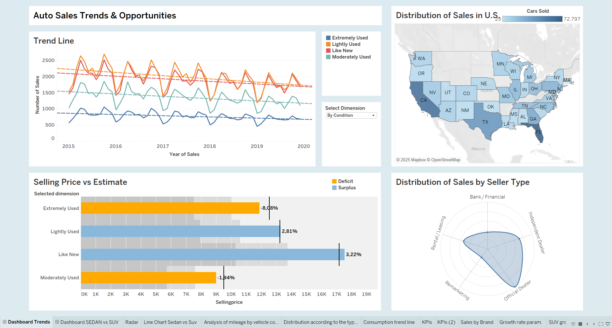
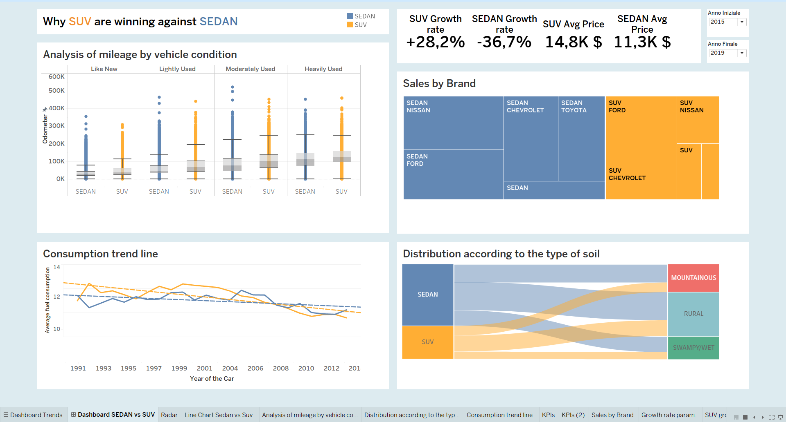

# Data Warehouse Project

## Overview
This repository contains the source code, data processing scripts, and documentation for the **Data Warehouse and Visualization** project. The objective of this project is to clean, transform, and analyze a dataset of car prices, culminating in a visual report using Tableau.

## Repository Structure

The repository is organized into the following directories:

*   **`scripts/`**: Contains all Python scripts used for the ETL (Extract, Transform, Load) process, including data cleaning, normalization, imputation, and quality metrics calculation.
*   **`tableau/`**: Contains the Tableau workbooks (`.twb` and `.twbx`) used for data visualization and reporting.
*   **`docs/`**: Includes the final project report (`difranco_report_data_warehouse.pdf`) and dashboard screenshots (`dashboard1.png`, `dashboard2.png`).

## Scripts Description

The `scripts/` directory includes various utilities to prepare the data:

*   **Data Cleaning & Standardization**:
    *   `cleaning.py`: Main script for general data cleaning (removing nulls, duplicates).
    *   `reformat_date.py`: Standardizes date formats.
    *   `adjusted_body.py`, `adjusted_color.py`, `adjusted_state.py`, `adjusted_trim.py`: Scripts to normalize and standardize specific categorical columns.
    *   `group_body.py`: Groups vehicle body types into broader categories.

*   **Data Imputation**:
    *   `fill_fuel_consumption.py`, `fill_type_land.py`, `fill_type_seller.py`: Scripts to fill missing values in specific columns using appropriate strategies.

*   **Data Transformation**:
    *   `normalized_condition.py`: Normalizes condition ratings.
    *   `remove_outliers.py`: Identifies and handles outliers in numerical data.

*   **Data Quality**:
    *   `calculate_data_quality_metrics.py`: Calculates and reports metrics to ensure data quality and integrity.

## Visualization

The analysis results are visualized using Tableau. You can find the workbook in the `tableau/` directory.

### Project Dashboards

Below are the previews of the dashboards created for this project:


*Dashboard 1 Overview*


*Dashboard 2 Overview*

*   **`Cartella9.twbx`**: Packaged Tableau workbook containing the dashboards and data.

## Documentation

For a detailed explanation of the methodology, data model, and findings, please refer to the project report located in `docs/difranco_report_data_warehouse.pdf`.

## Usage

### 1. Dataset Preparation
First, download the dataset from Kaggle:
[Vehicle Sales Data](https://www.kaggle.com/datasets/syedanwarafridi/vehicle-sales-data)

Save the dataset in the root directory of the project.

### 2. Data Processing
You can run the individual scripts in the `scripts/` directory to perform specific cleaning or transformation tasks.
To generate the final, fully processed CSV file, execute the scripts in sequence.

Example:
```bash
python scripts/cleaning.py
python scripts/adjusted_body.py
# ... and so on for other scripts
```

### 3. Visualization
To explore the interactive dashboards and the visual analysis:
1. Ensure you have **Tableau Desktop** installed.
2. Navigate to the `tableau/` directory.
3. Open `Cartella9.twb`.